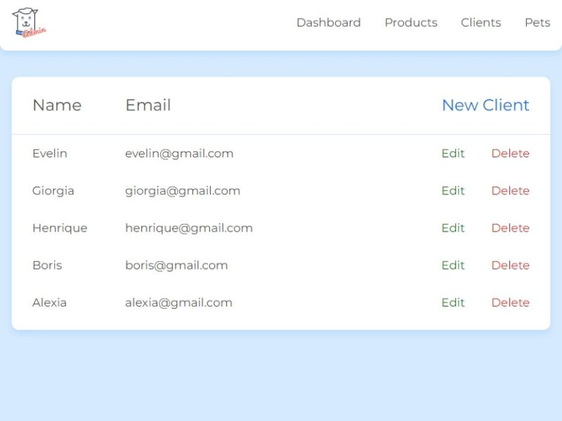

<div align="center"> 
  <h1>Petshop CRUD Project</h1>
</div>
<div align="center"> 
  
  
  
   
  
  
</div>

## Description

This project is a simple CRUD (Create, Read, Update, Delete) application for managing client profiles in a pet shop. The main goal was to learn how to use CRUD operations, interact with a RESTful API using `fetch`, and handle asynchronous operations with `async`/`await` and `try-catch` blocks.

## Key Features

- **Create, Read, Update, and Delete client profiles**
- **Handle asynchronous operations with `fetch` API**
- **Use of `async`/`await` for cleaner code**

## Screenshots

<div align="center">
  
</div>

## Additional Information

- This project is part of the JavaScript course from freeCodeCamp.
- Developed by Evelin Alvarado.
- Find me on [GitHub](https://github.com/EvelinAlvarado) and [LinkedIn](https://www.linkedin.com/in/evelinalvarado/).

Check out the live project: [Petshop CRUD Project](https://petshop-project-crud-js-async.vercel.app/)

### Note

If you encounter any issues with the live deployment, you can clone the repository and run it locally. Use the following command to set up a local server:

```bash
git clone https://github.com/EvelinAlvarado/petshop-project-crud-js-async.git
cd petshop-project-crud-js-async
json-server --watch ./db.json --port=3000
